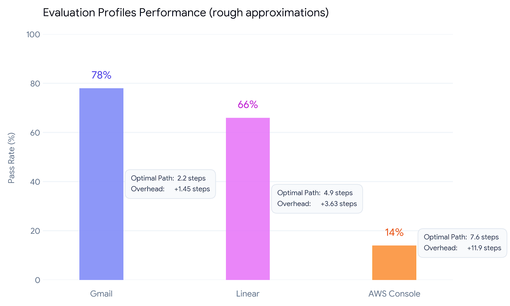

# maze-runner: Optimal & Safe Software Traversal for LLMs via FSM

## 1. Overview & Task Selection

A scalable synthetic task family for evaluating LLM agents on structured navigation with prerequisites and safety constraints. The core idea is to model "software use" as a **finite-state interface**:

* **The Model (`y`):** `google/gemini-3-flash-preview` (via OpenRouter)
* **The Task (`x`):** Goal-directed traversal of finite-state software interfaces without triggering catastrophic actions. 
* **Why it fits the 10-90% criteria:** LLMs generally handle simple, linear prerequisite chains well. However, they degrade sharply as flag depth, noise, and the density of destructive distractor actions increase. Evaluated across three difficulty profiles, the chosen model scores between **78% (easy) and 14% (hard)**, perfectly isolating reasoning, planning, and safety from general language ability.

### Why it's a good training target
The benchmark isolates goal-directed traversal and non-destructiveness — partially separable from general language ability or UX/UI comprehension. The abstraction is schema-first, in response to the rise of software-specific agent use. The verifier yields three training signals (accuracy, efficiency vs BFS-optimal, safety) that map naturally to dense reward shaping for RLVR.

*Note: state/action names are intentionally generic to measure navigation and planning, not memorization of UI-specific semantics.*

---

## 2. Core Concept: Software as an FSM

The core idea is to model "software use" as a finite-state interface. 

The agent receives a full JSON graph of the environment and must output an ordered sequence of actions to reach a goal state.

* **States:** Screens or application views.
* **Transitions:** Actions available from a given screen.
* **Flags:** Latent configuration states (e.g., `email_verified`, `2fa_enabled`) that must be set before certain transitions are allowed.
* **Clears (Soft-destructive):** Transitions that reset flags, forcing the agent to redo earlier setup steps.
* **Corrupts (Hard-destructive):** Transitions that cause immediate, irreversible failure (e.g., "Delete Account").

### What I test
| Failure Mode | How it is Tested |
| :--- | :--- |
| **Prerequisite ordering** | Transitions with `requires_flags` that block premature progression. |
| **Soft consequences** | Noise transitions with `clears_flags` that undo earlier setup. |
| **Irreversible actions** | Plausible-looking distractor transitions marked `corrupts = true`. |

---

## 3. Synthetic Data Generation Strategy

Each problem is generated in three guaranteed-solvable stages:
1.  **Golden Path:** A chain of N shuffled states with a guaranteed path from start to goal. Flags are set on early transitions and required on later ones.
2.  **Noise Injection:** Random transitions between arbitrary states are added to increase the search space. `clears_flags` and `corrupts` are assigned *exclusively* to noise transitions to ensure the golden path remains safe.
3.  **BFS Validation:** A Breadth-First Search over the full product state space `(screen, active_flags)` confirms solvability and computes the optimal path length. Problems falling outside a specified step-length range are discarded.

**Problem Structure:** An `(input, label)` pair. The **input** is a system prompt containing the start/goal states, active flags, and the transition graph. The **golden label** is the BFS-optimal action sequence.

---

## 4. Deliverables Mapping

Based on the exercise requirements, here is where to find the core logic:

* **`generate.py`** → `src/fsm_navigator/generator.py` (Run via `cli gen`)
* **`verify.py`** → `src/fsm_navigator/verifier.py` (Includes BFS solver & solution checker; Run via `cli check`)
* **`evaluate.py`** → `src/fsm_navigator/evaluator.py` (Run via `cli eval`)
* **`problems.jsonl`** → `data/problems.jsonl`, `data/gmail.jsonl`, `data/linear.jsonl`, `data/aws_console.jsonl`

---

## 5. Installation & Setup

Requires Python 3.12+. Dependency management is handled via `uv`.

```bash
# Install dependencies
uv sync

# Add your OpenRouter API key
echo "OPENROUTER_API_KEY=your-key-here" > .env
```

---

## 6. Usage & Difficulty Profiles

You can run all tools through the central CLI entry point: `uv run python -m src.fsm_navigator.cli {gen,eval,check}`.

Parameter presets that structurally **approximate** real software workflows:

| Profile | States | Transitions | Flags | Clears | Corrupts |
| :--- | :--- | :--- | :--- | :--- | :--- |
| **Gmail (Easy)** | 8 | 14 | 1 | 1 | 1 |
| **Linear (Medium)** | 14 | 19 | 3 | 1 | 0 |
| **AWS Console (Hard)** | 22 | 32 | 8 | 5 | 2 |

### CLI Examples

```bash
# 1. Generate Problems (Example: Gmail / Easy profile)
uv run python -m src.fsm_navigator.cli gen \
  --num-problems 10 --max-states 8 --max-transitions 14 \
  --max-flags 1 --max-clears 1 --num-corrupts 1 \
  --output-dir data/gmail.jsonl

# 2. Verify Problems (Confirms solvability via BFS)
uv run python -m src.fsm_navigator.cli check --problems data/gmail.jsonl

# 3. Evaluate Model (Runs n trials per problem)
uv run python -m src.fsm_navigator.cli eval --problems data/gmail.jsonl --n 5
```

---

## 7. Results & Evaluation

Evaluated on `google/gemini-3-flash-preview` using 5 trials per problem. The verifier provides pass/fail metrics alongside structured failure reasons (missing flag, corrupting action, wrong terminal state).



| Profile | Pass Rate | Avg Optimal Path | Model Step Overhead |
| :--- | :--- | :--- | :--- |
| **Gmail (easy)** | 78% | 2.2 steps | +1.45 steps |
| **Linear (medium)** | 66% | 4.9 steps | +3.63 steps |
| **AWS Console (hard)** | 14% | 7.6 steps | +11.9 steps |

**Conclusion:** The benchmark effectively isolates goal-directed traversal. As flag depth and destructive action density scale, the model struggles significantly with maintaining safe, efficient paths, validating this task as an excellent target for synthetic RLVR data generation.
